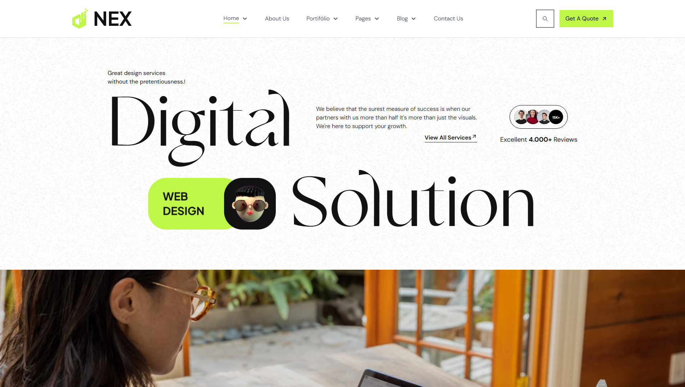
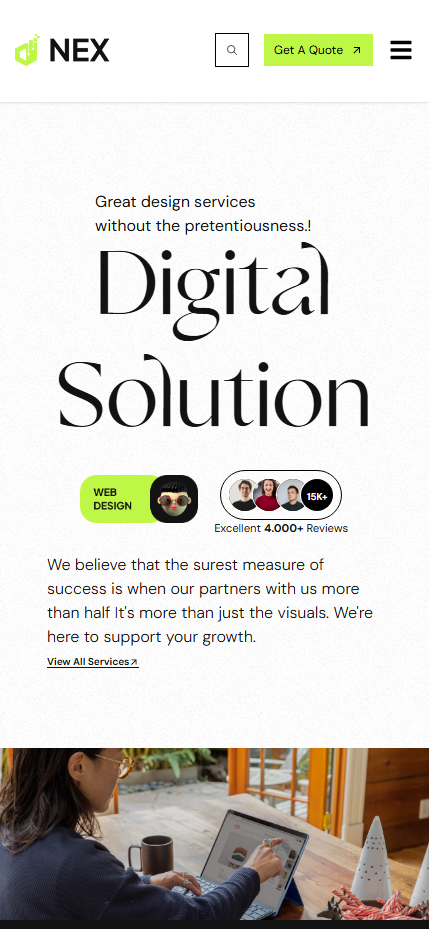

<h1>Test Noweb</h1>

Uma aplicação mobile-first desenvolvida com Vite + React + TypeScript + TailwindCSS, que consome a API ViaCEP para busca e preenchimento automático de informações de endereço a partir de um CEP.

🚀 Tecnologias utilizadas
<ul>
  <li>Vite</li>
  <li>React</li>
  <li>React Icons</li>
  <li>TypeScript</li>
  <li>TypeScript</li>
  <li>TailwindCSS</li>
  <li>Axio</li>
</ul>

📥 Como rodar o projeto
bash
Copiar
Editar
# 1️º Clonar o repositório
git clone git@github.com:VitongoviskDev/Noweb.git

# 2️º Entrar na pasta do projeto
cd Noweb

# 3️º Instalar dependências
npm install

# 4️º Rodar o servidor de desenvolvimento
npm run dev
🌐 Acessando no navegador
Após iniciar o projeto, abra no navegador: http://localhost:5173

<h3>Você também pode acessar a página através clicando [Link](https://noweb-rho.vercel.app) ou copiando esta URL https://noweb-rho.vercel.app</h3>

📱 Esta página foi construída com o conceito mobile-first para garantir a responsividade e uma boa experiencia para todos.

Prévia Desktop/Mobile

